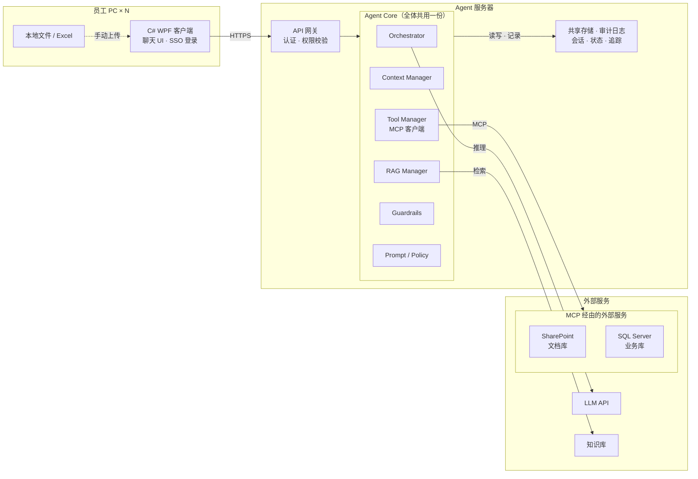
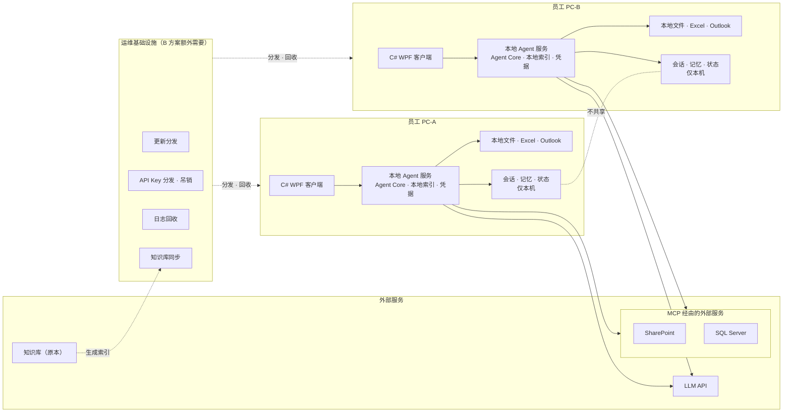

# 企业 AI Agent：方案 A（集中型）与方案 B（分布型）对比分析

> 版本：2026-09-25 ｜ 依据：架构图第一版（外部服务区的 Asana 已替换为经 MCP 连接的 SharePoint / SQL Server）｜ 用途：内部评审

---

## 0. 摘要

两个方案的根本区别不是「AI 放在哪」，而是 **Agent 的状态、凭据和数据连接放在哪**：

| | 方案 A 集中型 | 方案 B 分布型 |
|---|---|---|
| 一句话 | PC 只是入口，Agent 在服务器上只有一份 | 每台 PC 都是一个独立的 Agent |
| 部署单元 | 1 套服务器 + N 个轻客户端 | N 套完整 Agent |
| 状态与凭据 | 集中在服务器 | 分散在每台 PC |
| 最擅长 | 管理、审计、共享、权限控制 | 直接操作本机文件和应用 |
| 最大代价 | 服务器建设运维；碰不到本机资源 | N 台 PC 的分发、凭据、日志、同步 |

**提炼一句：A 赢在「管得住」，B 赢在「够得着」。** 对于数据源是 SharePoint 和 SQL Server 这类企业系统的问答 Agent，「管得住」的权重通常更高；只有当「直接操作员工本机」是核心需求时，B 的优势才会显现（而这时方案 C 往往是更合适的折中）。

---

## 1. 前提与范围

- **入口**：C# WPF 客户端（Asana 已移出范围）。
- **数据源**：SharePoint（文档）、SQL Server（业务数据），均通过 **MCP** 以工具形式接入 Agent。
- **LLM**：两个方案都使用云端 LLM API。「Agent 在 PC 上」≠「LLM 在 PC 上」，在每台 PC 上运行模型不在讨论范围内。
- **逻辑结构相同**：两个方案的 Agent Core 模块完全一样，区别只在「部署在哪」「状态存哪」。

---

## 2. 功能模块介绍

### 2.1 共同模块：Agent Core

| 模块 | 职责 | 典型内容 |
|---|---|---|
| **Orchestrator** | 计划与执行控制 | 理解意图、拆解步骤、决定调用哪个工具、何时结束 |
| **Context Manager** | 会话上下文 | 历史消息、用户记忆、上下文长度裁剪 |
| **Tool Manager** | 工具调用 | 作为 MCP 客户端注册和调用工具（SharePoint、SQL Server 等） |
| **RAG Manager** | 知识检索 | 检索知识库、整理引用来源 |
| **Guardrails** | 输入输出检查 | 敏感信息过滤、越权请求拦截、输出格式与内容检查 |
| **Prompt / Policy** | 提示词与策略 | 系统提示词、工具使用规则、权限策略的版本管理 |

### 2.2 方案 A 的模块构成

| 位置 | 模块 | 说明 |
|---|---|---|
| 员工 PC | C# WPF 客户端 | 聊天 UI、企业账号登录（SSO）、附件上传；不含 Agent 逻辑，不保存凭据 |
| Agent 服务器 | API 网关 | HTTPS 接入、身份认证、权限校验、限流 |
| Agent 服务器 | Agent Core | 上述 6 个模块，全体用户共用一份 |
| Agent 服务器 | 共享存储 · 审计日志 | 会话历史与记忆、Agent 执行状态、审计日志与调用追踪 |
| 外部服务 | MCP 经由的外部服务 | SharePoint（文档库）、SQL Server（业务库），只对服务器开放 |
| 外部服务 | LLM API | 云端推理 |
| 外部服务 | 知识库 | RAG 检索对象 |

### 2.3 方案 B 的模块构成

| 位置 | 模块 | 说明 |
|---|---|---|
| 员工 PC | C# WPF 客户端 | 界面；通过 localhost（gRPC / HTTP）与本地 Agent 服务通信 |
| 员工 PC | 本地 Agent 服务（.NET 常驻） | 上述 6 个模块，**每台 PC 各一份** |
| 员工 PC | 本地 RAG 索引 | 从知识库原本分发下来的检索索引 |
| 员工 PC | 凭据存储 | LLM API Key、MCP / 数据库连接所需的凭据 |
| 员工 PC | 本地状态 | 会话、记忆、执行状态，**仅存在于本机** |
| 员工 PC | 本地资源 | 可直接操作的文件、Excel、Outlook |
| 外部服务 | LLM API / MCP 经由的外部服务 / 知识库原本 | 由每台 PC 直接连接 |
| 运维基础设施 | 更新分发 | 把 Agent 程序和提示词推送到所有 PC |
| 运维基础设施 | API Key 分发 · 吊销 | 管理每台 PC 的凭据，离职或泄露时吊销 |
| 运维基础设施 | 日志回收 | 从各 PC 收集执行记录，用于审计 |
| 运维基础设施 | 知识库同步 | 保证所有 PC 的索引版本一致 |

> 注意：方案 B 的「运维基础设施」在架构图上容易被忽略，但它是 B 能在企业里正常运行的前提，也是 B 的主要隐性成本。

---

## 3. 架构对比

### 3.1 方案 A 架构

### 3.2 方案 B 架构

### 3.3 结构差异

| 维度 | 方案 A | 方案 B |
|---|---|---|
| Agent 实例数 | 1（可水平扩展为多实例，但逻辑上是一个） | N（PC 台数） |
| PC 上的内容 | 仅客户端 | 客户端 + 完整 Agent + 索引 + 凭据 + 状态 |
| 会话 / 状态存放 | 服务器共享存储 | 各 PC 本地 |
| 凭据存放 | 服务器 | 每台 PC |
| 对外连接的发起方 | 服务器（1 个出口） | 每台 PC（N 个出口） |
| SharePoint / SQL Server 需要开放给 | 服务器 | 所有员工 PC（或经中央 MCP 服务器，见 3.4） |
| 知识库索引 | 1 份 | N 份副本 |
| 更新路径 | 更新服务器 | 分发到 N 台 PC |
| 审计数据 | 天然集中 | 需要回收汇总 |

### 3.4 MCP 在两个方案中的位置（关键）

MCP 有两个角色：**MCP 客户端**（Agent 的 Tool Manager）和 **MCP 服务器**（把 SharePoint、SQL Server 包装成工具）。两个方案的差异在于 MCP 服务器放在哪里。

- **方案 A**：MCP 客户端和 MCP 服务器都在服务器侧。SQL Server 的连接只存在于服务器上；SharePoint 可以用用户的委托令牌访问，从而沿用用户本来的文档权限。
- **方案 B** 有两种做法，各有问题：
  1. **MCP 服务器也装在每台 PC 上**（stdio 方式）：每台 PC 都要持有 SQL Server 连接信息，业务库要对所有 PC 开放。安全团队通常很难接受。
  2. **MCP 服务器集中部署在一台服务器上**（远程 HTTP 方式），PC 上的 Agent 远程调用：凭据问题解决了，但这等于**已经有了一台中央服务器**，架构实际上在向方案 A / C 靠拢。

> 提炼：**一旦数据源是需要严格管控的企业系统，方案 B 迟早要长出一台中央服务器。** 这是评估 B 时最容易被低估的一点。

---

## 4. 优缺点分析

### 4.1 方案 A 集中型

**优点**

- **更新一处生效**：提示词或 Agent 逻辑有问题，改服务器即可，所有用户立即生效，不存在版本不一致。
- **凭据集中**：LLM API Key、SQL Server 连接信息只在服务器上，PC 被盗或员工离职都不涉及凭据泄露。
- **权限可控**：SharePoint 文档权限、SQL Server 数据权限都在服务器统一执行。
- **可审计**：提问、检索到的文档、调用的工具、生成的回答可以作为一条完整链路记录，「为什么这样回答」可以追溯。
- **跨 PC 共享**：会话和状态属于用户而不属于某台电脑，换 PC 登录可以继续。
- **PC 要求低**：客户端很轻。

**缺点**

- **碰不到本机资源**：服务器不能读取员工 PC 上的文件和应用，只能让用户手动上传。
- **单点依赖**：服务器或网络故障时，所有用户都无法使用（需要做高可用）。
- **需要建设服务器**：部署、监控、扩容、备份都要有人负责。

### 4.2 方案 B 分布型

**优点**

- **本机集成最自然**：可以直接读写本地文件、操作 Excel、Outlook 等桌面应用。
- **起步不需要 Agent 服务器**：适合小范围试点。
- **不受自有服务器故障影响**（但仍依赖 LLM API 和外部服务，完全离线无法生成回答）。

**缺点**

- **更新难**：N 台 PC 需要分发、回滚、兼容性管理，版本很容易不一致。
- **凭据分散**：每台 PC 都保存 API Key 和数据连接信息，泄露面随 PC 数量增加，吊销也困难。
- **数据库暴露面大**：SQL Server 需要对所有 PC 开放（除非另建中央 MCP 服务器，见 3.4）。
- **权限风险**：本地索引若包含全部文档，用户可能检索到自己在 SharePoint 上无权查看的内容；按用户分别生成索引又会加重同步负担。
- **知识不一致**：不同 PC 的索引版本不同，同一个问题可能得到不同答案，而且很难排查。
- **不能跨 PC 共享**：换一台电脑，之前的会话和状态都不在。
- **审计困难**：日志分散在各 PC，需要回收汇总。
- **本质上是在运营一个桌面软件产品**：需要自动更新、崩溃恢复、错误上报、本地配置管理，工作量远超「开发一个 Agent」。

### 4.3 对比汇总

● 有利　◐ 有条件 / 中等　○ 不利（所有行方向一致）

| 对比项 | A 集中型 | B 分布型 |
|---|---|---|
| 更新 · 分发 | ● 只更新服务器 | ○ 分发到所有 PC |
| 凭据管理 | ● 服务器集中 | ○ 分散在每台 PC |
| SharePoint 文档权限 | ● 服务器统一执行 | ○ 本地索引有越权风险 |
| SQL Server 访问控制 | ● 只对服务器开放 | ○ 需对所有 PC 开放 |
| 审计 · 追溯 | ● 完整链路集中记录 | ○ 需回收汇总 |
| 跨 PC 共享会话 | ● 默认支持 | ○ 需另建同步 |
| 知识一致性 | ● 一份索引 | ○ N 份副本可能不一致 |
| 本机文件 · 应用集成 | ○ 手动上传 | ● 直接操作 |
| 自有服务器故障影响 | ○ 全员不可用 | ● 不受影响 |
| 开发复杂度 | ● 低 | ◐ 中 |
| 运维负担 | ● 只有服务器 | ○ 所有 PC 都是运维对象 |
| PC 性能要求 | ● 低 | ◐ 常驻服务 + 本地索引 |

---

## 5. 场景对比

| # | 场景 | 方案 A | 方案 B | 差异要点 |
|---|---|---|---|---|
| 1 | 「出差住宿标准是多少？」（答案在 SharePoint 文档中） | 服务器按用户权限检索，LLM 生成回答并附原文链接 | 本地 Agent 检索本机索引，LLM 生成回答 | B 需保证本地索引不含用户无权查看的文档 |
| 2 | 「上个月各区域销售额是多少？」（数据在 SQL Server） | 服务器经 MCP 用只读账号查询，结果交给 LLM 整理 | 本地 Agent 经 MCP 直连业务库查询 | B 需让每台 PC 能连业务库并持有连接信息 |
| 3 | 「总结下载文件夹里的 销售.xlsx」 | 用户手动上传附件，服务器解析后总结 | 本地 Agent 直接读取文件并总结 | **B 的主场**；A 只能靠用户上传 |
| 4 | 在 PC-A 开始的对话，换到 PC-B 继续 | 登录即可继续 | PC-B 上没有记录，无法继续 | B 要支持就得加中央存储 |
| 5 | 发现提示词有问题，需要紧急修正 | 改服务器，立即对全员生效 | 发布新版本，等各 PC 更新完成 | B 存在新旧版本并存的时间窗 |
| 6 | 客户问「为什么 AI 给出了这个答案？」 | 查审计日志，看到检索的文档和调用的工具 | 需要先从那台 PC 取回日志（如果还在） | 企业 AI 项目中非常常见的问题 |
| 7 | 员工离职或 PC 丢失 | 停用账号即可，PC 上没有凭据和数据 | 需吊销该 PC 的凭据，本机会话数据可能泄露 | 凭据位置决定处置难度 |
| 8 | 自有服务器宕机 | 全员不可用 | 各 PC 继续工作（LLM API 可用时） | **B 唯一明显占优的可用性场景** |

---

## 6. 职责划分

| 功能 | 方案 A | 方案 B |
|---|---|---|
| 界面（聊天 UI） | PC | PC |
| 登录 · 身份认证 | PC 发起，服务器校验 | PC |
| 权限校验 | 服务器 | PC（各自实现） |
| Agent 计划 · 执行（Orchestrator） | 服务器 | PC |
| 会话 · 记忆 · 执行状态 | 服务器 | PC |
| 知识检索（RAG） | 服务器 | PC（分发的索引） |
| SharePoint 访问（MCP） | 服务器 | PC（或中央 MCP 服务器） |
| SQL Server 访问（MCP） | 服务器 | PC（或中央 MCP 服务器） |
| 提示词 · 策略管理 | 服务器 | PC（分发） |
| 凭据保管 | 服务器 | PC |
| 本地文件 · 应用操作 | 无（用户手动上传） | PC |
| 审计日志 | 服务器 | PC（需回收） |
| 更新 · 分发 | 服务器部署 | 运维基础设施 → 各 PC |
| LLM 推理 | 云端 API | 云端 API |

---

## 7. 判断要点

决定选 A 还是 B，关键看下面几个问题的答案：

1. **是否需要跨 PC 继续会话？** 需要 → 状态必须集中 → 排除 B。
2. **是否必须让 Agent 直接操作本机文件和应用？** 必须 → A 不够 → 考虑 B，但更建议看方案 C（服务器保留大脑和记忆，PC 只提供本地工具）。
3. **SQL Server 是否允许员工 PC 直连？** 不允许 → B 只能加中央 MCP 服务器 → 实际上已接近 A / C。
4. **SharePoint 文档权限是否必须严格反映在回答中？** 必须 → 集中做权限过滤的 A 更容易保证。
5. **PC 台数和现有的软件分发能力？** 台数多、没有分发机制 → B 的运维成本会很高。

**提炼：** 如果 2 的答案是「不必须」，A 在几乎所有企业关心的维度上占优；如果是「必须」，真正要对比的是 A 和 C，而不是 A 和 B。

---

## 附：待确认

- 架构图外部服务区中的「知识库（社内文書・DB）」与 SharePoint、SQL Server 在内容上是否重叠？如果知识库就是 SharePoint 文档，建议删除该框或改名为「检索索引」，避免客户误以为是三个独立数据源。
- MCP 服务器的部署位置（每台 PC / 中央服务器）需要在方案 B 的说明中明确，否则 B 的安全评估无法进行。
