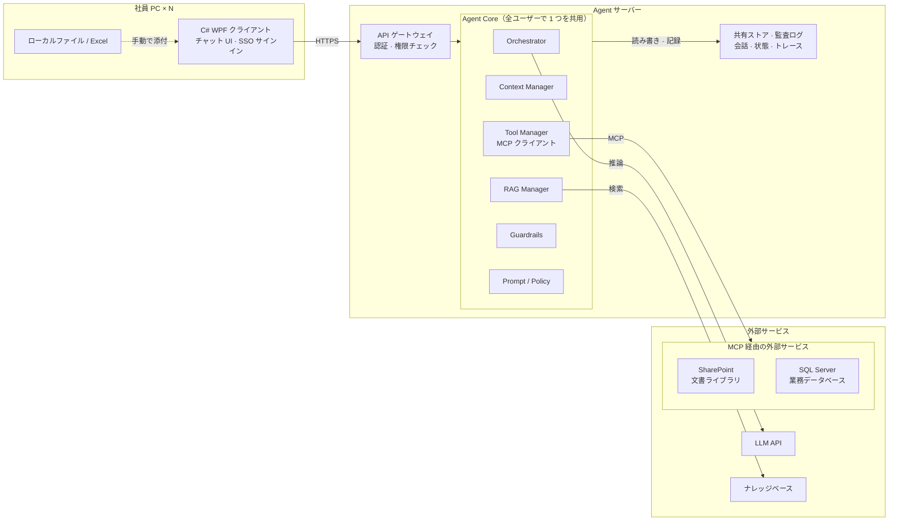
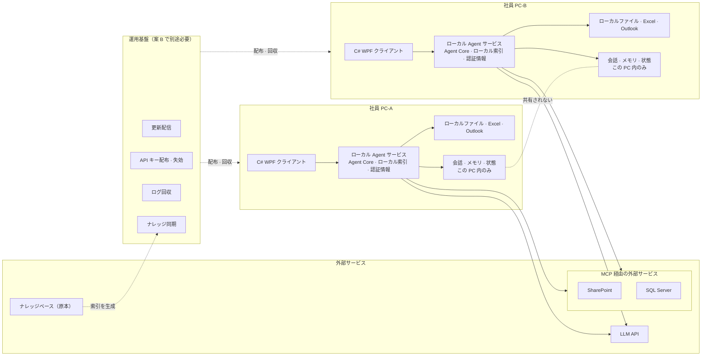

# 社内 AI Agent：案 A（集中型）と案 B（分散型）の比較分析

> 版：2026-09-25 ｜ 前提：アーキテクチャ図 第 1 版（外部サービス欄の Asana を、MCP 経由で接続する SharePoint / SQL Server に置き換え済み）｜ 用途：内部レビュー

---

## 0. サマリー

2 つの案の本質的な違いは「AI をどこに置くか」ではなく、**Agent の状態・認証情報・データ接続をどこに置くか**です。

| | 案 A 集中型 | 案 B 分散型 |
|---|---|---|
| ひとことで | PC は入口にすぎず、Agent はサーバーに 1 つだけ | PC 1 台ごとに独立した Agent がある |
| 配置単位 | サーバー 1 式 + 軽量クライアント N 台 | 完全な Agent × N 式 |
| 状態と認証情報 | サーバーに集約 | 各 PC に分散 |
| 最も得意なこと | 管理・監査・共有・権限制御 | 手元 PC のファイルやアプリの直接操作 |
| 最大のコスト | サーバーの構築・運用。手元の資源には届かない | N 台の PC への配布・認証情報・ログ・同期 |

**要するに、A は「管理しやすい」、B は「手元に届く」。** SharePoint や SQL Server のような社内システムをデータソースとする Q&A Agent では、通常「管理しやすい」ことの重みが大きくなります。B の強みが活きるのは「社員の PC を直接操作すること」が中核要件の場合に限られ、その場合でも案 C の方が適した落としどころになることが多いと考えます。

---

## 1. 前提と対象範囲

- **入口**：C# WPF クライアント（Asana は対象外とした）。
- **データソース**：SharePoint（文書）、SQL Server（業務データ）。どちらも **MCP** 経由でツールとして Agent に接続する。
- **LLM**：両案ともクラウドの LLM API を利用する。「Agent が PC 上にある」≠「LLM が PC 上にある」。各 PC でモデルを動かす構成は対象外。
- **論理構成は共通**：Agent Core のモジュールは両案でまったく同じ。違いは「どこに配置するか」と「状態をどこに保存するか」だけ。

---

## 2. 機能モジュールの紹介

### 2.1 共通モジュール：Agent Core

| モジュール | 役割 | 主な内容 |
|---|---|---|
| **Orchestrator** | 計画・実行制御 | 意図の理解、手順の分解、どのツールを呼ぶか・いつ終えるかの判断 |
| **Context Manager** | 会話コンテキスト | 会話履歴、ユーザーメモリ、コンテキスト長の調整 |
| **Tool Manager** | ツール呼び出し | MCP クライアントとしてツール（SharePoint、SQL Server など）を登録・呼び出し |
| **RAG Manager** | ナレッジ検索 | ナレッジベースの検索、引用元の整理 |
| **Guardrails** | 入出力チェック | 機密情報のフィルタ、越権リクエストの遮断、出力形式・内容のチェック |
| **Prompt / Policy** | プロンプトとポリシー | システムプロンプト、ツール利用ルール、権限ポリシーのバージョン管理 |

### 2.2 案 A のモジュール構成

| 配置場所 | モジュール | 説明 |
|---|---|---|
| 社員 PC | C# WPF クライアント | チャット UI、社内アカウントでのサインイン（SSO）、添付ファイルのアップロード。Agent のロジックを持たず、認証情報も保存しない |
| Agent サーバー | API ゲートウェイ | HTTPS の受付、認証、権限チェック、流量制限 |
| Agent サーバー | Agent Core | 上記 6 モジュール。全ユーザーで 1 つを共用 |
| Agent サーバー | 共有ストア・監査ログ | 会話履歴とメモリ、Agent の実行状態、監査ログと呼び出しトレース |
| 外部サービス | MCP 経由の外部サービス | SharePoint（文書ライブラリ）、SQL Server（業務データベース）。サーバーにのみ開放 |
| 外部サービス | LLM API | クラウド推論 |
| 外部サービス | ナレッジベース | RAG の検索対象 |

### 2.3 案 B のモジュール構成

| 配置場所 | モジュール | 説明 |
|---|---|---|
| 社員 PC | C# WPF クライアント | UI。localhost（gRPC / HTTP）でローカル Agent サービスと通信 |
| 社員 PC | ローカル Agent サービス（.NET 常駐） | 上記 6 モジュール。**PC ごとに 1 式** |
| 社員 PC | ローカル RAG 索引 | ナレッジベースの原本から配布された検索用索引 |
| 社員 PC | 認証情報ストア | LLM の API キー、MCP やデータベースへの接続に必要な認証情報 |
| 社員 PC | ローカル状態 | 会話、メモリ、実行状態。**その PC 内にのみ存在** |
| 社員 PC | ローカル資源 | 直接操作できるファイル、Excel、Outlook |
| 外部サービス | LLM API / MCP 経由の外部サービス / ナレッジベース原本 | 各 PC から直接接続 |
| 運用基盤 | 更新配信 | Agent プログラムとプロンプトを全 PC へ配信 |
| 運用基盤 | API キー配布・失効 | PC ごとの認証情報を管理し、退職・漏えい時に失効させる |
| 運用基盤 | ログ回収 | 各 PC の実行記録を監査用に収集 |
| 運用基盤 | ナレッジ同期 | 全 PC の索引のバージョンを揃える |

> 注意：案 B の「運用基盤」はアーキテクチャ図では見落とされがちですが、B を企業内で正常に運用するための前提条件であり、B の主要な隠れコストです。

---

## 3. アーキテクチャ比較

### 3.1 案 A のアーキテクチャ

### 3.2 案 B のアーキテクチャ

### 3.3 構造上の違い

| 観点 | 案 A | 案 B |
|---|---|---|
| Agent インスタンス数 | 1（複数インスタンスへ水平拡張できるが、論理的には 1 つ） | N（PC の台数） |
| PC 上にあるもの | クライアントのみ | クライアント + Agent 一式 + 索引 + 認証情報 + 状態 |
| 会話・状態の保存先 | サーバーの共有ストア | 各 PC のローカル |
| 認証情報の保存先 | サーバー | 各 PC |
| 外部接続の発信元 | サーバー（出口は 1 か所） | 各 PC（出口は N か所） |
| SharePoint / SQL Server の開放先 | サーバー | 全社員 PC（または中央の MCP サーバー経由。3.4 参照） |
| ナレッジ索引 | 1 つ | N 個のコピー |
| 更新の経路 | サーバーを更新 | N 台の PC へ配信 |
| 監査データ | 最初から集約されている | 回収・集計が必要 |

### 3.4 両案における MCP の位置づけ（重要）

MCP には 2 つの役割があります。**MCP クライアント**（Agent の Tool Manager）と、**MCP サーバー**（SharePoint や SQL Server をツールとして公開するもの）です。両案の違いは、MCP サーバーをどこに置くかにあります。

- **案 A**：MCP クライアントも MCP サーバーもサーバー側にある。SQL Server への接続情報はサーバー上にしか存在しない。SharePoint にはユーザーの委任トークンでアクセスでき、ユーザー本来の文書権限をそのまま適用できる。
- **案 B** には 2 つのやり方があり、どちらにも問題がある。
  1. **MCP サーバーも各 PC にインストールする**（stdio 方式）：全 PC が SQL Server の接続情報を持ち、業務データベースを全 PC に開放する必要がある。セキュリティ部門が受け入れるのは一般に難しい。
  2. **MCP サーバーを 1 台のサーバーに集約する**（リモート HTTP 方式）で、PC 上の Agent からリモートで呼び出す：認証情報の問題は解決するが、これは**すでに中央サーバーを持っている**ことになり、構成は実質的に案 A / C に近づく。

> 要点：**データソースが厳格な管理を要する社内システムである限り、案 B はいずれ中央サーバーを持つことになる。** これは案 B を評価する際に最も過小評価されやすい点です。

---

## 4. メリット・デメリット分析

### 4.1 案 A 集中型

**メリット**

- **1 か所の更新で全員に反映**：プロンプトや Agent のロジックに問題があっても、サーバーを直せば全ユーザーに即時反映され、バージョンのばらつきが起きない。
- **認証情報を集約**：LLM の API キーや SQL Server の接続情報はサーバーにしかなく、PC の盗難や社員の退職で認証情報が漏れることがない。
- **権限を制御しやすい**：SharePoint の文書権限、SQL Server のデータ権限をサーバーで一元的に適用できる。
- **監査できる**：質問、検索した文書、呼び出したツール、生成した回答を一連のトレースとして記録でき、「なぜこの回答になったか」を後から追える。
- **PC をまたいで共有**：会話と状態は特定の PC ではなくユーザーに属するため、別の PC でサインインしても続きから使える。
- **PC への要求が低い**：クライアントが軽量。

**デメリット**

- **手元の資源に届かない**：サーバーは社員 PC 上のファイルやアプリを直接読めず、ユーザーが手動で添付する必要がある。
- **単一障害点**：サーバーやネットワークの障害時は全ユーザーが利用できない（冗長化が必要）。
- **サーバーの構築が必要**：デプロイ、監視、拡張、バックアップの担当者が必要。

### 4.2 案 B 分散型

**メリット**

- **ローカル連携が最も自然**：ローカルファイルの読み書きや、Excel・Outlook などデスクトップアプリの操作を直接行える。
- **Agent サーバーなしで始められる**：小規模な試行に向いている。
- **自社サーバーの障害の影響を受けない**（ただし LLM API と外部サービスには依存するため、完全なオフラインでは回答を生成できない）。

**デメリット**

- **更新が難しい**：N 台の PC への配信・ロールバック・互換性管理が必要で、バージョンが揃いにくい。
- **認証情報が分散**：各 PC が API キーやデータ接続情報を持つため、漏えい面が PC 台数に比例して広がり、失効も難しい。
- **データベースの露出が大きい**：SQL Server を全 PC に開放する必要がある（中央の MCP サーバーを別途構築しない限り。3.4 参照）。
- **権限リスク**：ローカル索引に全文書が含まれていると、ユーザーが SharePoint 上で閲覧権限のない内容まで検索できてしまう。ユーザーごとに索引を作ると同期の負担がさらに増える。
- **ナレッジの不一致**：PC ごとに索引のバージョンが異なると、同じ質問に違う回答が返り、原因調査も難しい。
- **PC をまたいで共有できない**：別の PC では、それまでの会話や状態が存在しない。
- **監査が難しい**：ログが各 PC に分散しており、回収・集計が必要。
- **実質的にデスクトップ製品を運営することになる**：自動更新、クラッシュ復旧、エラー報告、ローカル設定管理が必要で、工数は「Agent を開発する」範囲を大きく超える。

### 4.3 比較まとめ

● 有利　◐ 条件付き・中程度　○ 不利（すべての行で記号の向きを統一）

| 比較項目 | A 集中型 | B 分散型 |
|---|---|---|
| 更新・配布 | ● サーバーのみ更新 | ○ 全 PC へ配信 |
| 認証情報の管理 | ● サーバーに集約 | ○ 各 PC に分散 |
| SharePoint の文書権限 | ● サーバーで一元適用 | ○ ローカル索引に越権リスク |
| SQL Server のアクセス制御 | ● サーバーにのみ開放 | ○ 全 PC へ開放が必要 |
| 監査・追跡 | ● 一連のトレースを集約 | ○ 回収・集計が必要 |
| PC をまたぐ会話の共有 | ● 標準で可能 | ○ 同期の仕組みが別途必要 |
| ナレッジの一貫性 | ● 索引は 1 つ | ○ N 個のコピーが不一致になりうる |
| ローカルファイル・アプリ連携 | ○ 手動で添付 | ● 直接操作 |
| 自社サーバー障害の影響 | ○ 全員が利用不可 | ● 影響なし |
| 開発の複雑さ | ● 低い | ◐ 中程度 |
| 運用の負荷 | ● サーバーのみ | ○ 全 PC が運用対象 |
| PC の性能要件 | ● 低い | ◐ 常駐サービス + ローカル索引 |

---

## 5. シーン別比較

| # | シーン | 案 A | 案 B | 違いのポイント |
|---|---|---|---|---|
| 1 | 「出張時の宿泊費の上限は？」（答えは SharePoint の文書にある） | サーバーがユーザーの権限で検索し、LLM が原文リンク付きで回答 | ローカル Agent が PC 内の索引を検索し、LLM が回答 | B はローカル索引に閲覧権限のない文書が含まれないよう保証が必要 |
| 2 | 「先月の地域別売上は？」（データは SQL Server にある） | サーバーが MCP 経由で読み取り専用アカウントで照会し、結果を LLM が整理 | ローカル Agent が MCP 経由で業務 DB に直接照会 | B は全 PC が業務 DB に接続でき、接続情報を持つ必要がある |
| 3 | 「ダウンロードフォルダの 売上.xlsx を要約して」 | ユーザーが手動で添付し、サーバーが解析して要約 | ローカル Agent がファイルを直接読んで要約 | **B の得意領域**。A はユーザーの添付に頼るしかない |
| 4 | PC-A で始めた会話を PC-B で続ける | サインインすればそのまま続行 | PC-B には記録がなく続行できない | B で対応するには中央ストアの追加が必要 |
| 5 | プロンプトの問題が見つかり、緊急で修正したい | サーバーを直せば全員に即時反映 | 新バージョンを配信し、各 PC の更新完了を待つ | B には新旧バージョンが混在する期間がある |
| 6 | 顧客から「なぜ AI はこう答えたのか」と聞かれた | 監査ログで検索文書と呼び出したツールを確認 | まずその PC からログを回収する必要がある（残っていれば） | 企業向け AI 案件では非常によくある質問 |
| 7 | 社員の退職、または PC の紛失 | アカウントを無効化するだけ。PC に認証情報もデータもない | その PC の認証情報を失効させる必要があり、PC 内の会話データが漏れる可能性もある | 認証情報の置き場所が対応の難しさを決める |
| 8 | 自社サーバーのダウン | 全員が利用不可 | 各 PC は利用を継続（LLM API が使える場合） | **B が明確に有利な唯一の可用性シーン** |

---

## 6. 役割分担

| 機能 | 案 A | 案 B |
|---|---|---|
| UI（チャット画面） | PC | PC |
| サインイン・認証 | PC から開始、サーバーで検証 | PC |
| 権限チェック | サーバー | PC（各自で実装） |
| Agent の計画・実行（Orchestrator） | サーバー | PC |
| 会話・メモリ・実行状態 | サーバー | PC |
| ナレッジ検索（RAG） | サーバー | PC（配布された索引） |
| SharePoint へのアクセス（MCP） | サーバー | PC（または中央の MCP サーバー） |
| SQL Server へのアクセス（MCP） | サーバー | PC（または中央の MCP サーバー） |
| プロンプト・ポリシー管理 | サーバー | PC（配布） |
| 認証情報の保管 | サーバー | PC |
| ローカルファイル・アプリの操作 | なし（ユーザーが手動で添付） | PC |
| 監査ログ | サーバー | PC（回収が必要） |
| 更新・配布 | サーバーへのデプロイ | 運用基盤 → 各 PC |
| LLM 推論 | クラウド API | クラウド API |

---

## 7. 判断のポイント

A と B のどちらを選ぶかは、次の問いへの答えで決まります。

1. **PC をまたいで会話を続ける必要があるか？** 必要 → 状態の集約が必須 → B は除外。
2. **Agent にローカルファイルやアプリを直接操作させることが必須か？** 必須 → A では不十分 → B を検討。ただし、より推奨するのは案 C（頭脳と記憶はサーバーに残し、PC はローカルツールだけを提供）。
3. **SQL Server への社員 PC からの直接接続は許可されるか？** 許可されない → B には中央 MCP サーバーの追加が必要 → 実質的に A / C に近づく。
4. **SharePoint の文書権限を回答に厳密に反映させる必要があるか？** 必要 → 権限フィルタを集中して行う A の方が保証しやすい。
5. **PC の台数と、既存のソフトウェア配布の仕組みは？** 台数が多く配布の仕組みがない → B の運用コストは非常に高くなる。

**要点：** 2 の答えが「必須ではない」なら、A は企業が重視するほぼすべての観点で優位です。「必須」であれば、本当に比較すべきは A と B ではなく A と C です。

---

## 付録：確認事項

- アーキテクチャ図の外部サービス欄にある「ナレッジベース（社内文書・DB）」は、SharePoint や SQL Server と内容が重複していないか。ナレッジベースが SharePoint の文書そのものであれば、この枠を削除するか「検索インデックス」に名称変更し、顧客が 3 つの独立したデータソースだと誤解しないようにすることを推奨。
- 案 B の説明では MCP サーバーの配置場所（各 PC / 中央サーバー）を明記する必要がある。明記しないと B のセキュリティ評価ができない。
